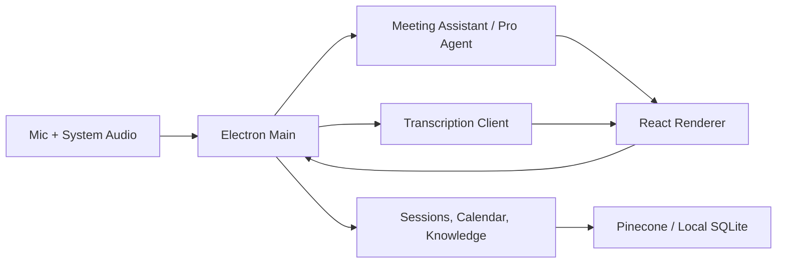

# Clyde

Clyde is a privacy-first desktop AI assistant for live interviews, meetings, and pre-call preparation. It is built with Electron, React, a native Rust audio sidecar, local persistence, optional local AI services, and optional cloud integrations for OpenAI, Pinecone, Gemini embeddings, Google, and LiveAvatar.

Clyde can sit beside a video call as a compact overlay, listen to microphone and system audio, transcribe the conversation, detect interviewer questions, generate answer cards, surface short memory reminders, and save the resulting transcript into an interview opportunity or meeting record.

## Features

### Live Capture

* Capture microphone and system audio as separate sources.
* Use the Rust `clyde-audio-engine` sidecar for low-latency audio capture, with legacy fallback paths for supported local audio capture tooling.
* Monitor live audio levels with RMS meters for `You` and `System Audio`.
* Pause, resume, reset, and stop active capture sessions.
* Use a compact floating active-capture overlay with draggable controls.
* Toggle capture protection so Clyde is hidden from normal screen-sharing capture.
* Adjust active overlay opacity and compact display behavior.
* Run a preflight modal before capture with connection checks, active models, audio test, active context preview, pinned files, and upload support.

### Transcription

* Transcribe with local Whisper-compatible endpoints.
* Transcribe with OpenAI Cloud Whisper.
* Stream partial and final transcripts through OpenAI Realtime Whisper.
* Drop quiet audio chunks before transcription using RMS thresholds.
* Filter unclear-audio sentinel responses and common silence hallucinations.
* Keep microphone and system speaker labels separate in the live transcript.

### Live AI Assistant

* Generate live answer cards for detected interview questions.
* Generate `Say next`, recap, action, follow-up, risk, insight, note, and screen-description cards depending on mode and command.
* Use Clyde Pro realtime WebSocket agent with `gpt-realtime-2` for faster draft/final answer generation.
* Warm the Pro realtime session when capture starts.
* Stream draft answer cards before final answers are ready.
* Keep answer generation fast by running memory/RAG retrieval separately from the first draft.
* Surface short Pro memory reminder cards after the answer card.
* Ask Clyde manually during capture with optional source selection.
* Capture a screenshot and ask questions about the current screen.
* Choose sources for custom prompts: resume/background, long-term memory, RAG, and web where configured.
* Dismiss individual assistant or memory cards.

### Interview Mode

* Track opportunities by company, role, outcome, and interview history.
* Store job descriptions per opportunity.
* Add manual transcripts.
* Save live sessions back to existing or new opportunities.
* Edit interview transcripts, metadata, examples, summaries, and notes.
* Automatically grade saved interview sessions with transcript-based evaluation.
* Differentiate failed evaluations from pending ones in the UI with a distinct red warning pill and actionable tooltip to re-authenticate or retry.
* Normalize transcript ratings and show star ratings on the timeline.
* Track opportunity outcomes such as active, advanced, rejected, and offer.
* Use outcome calibration from past advanced/offer/rejected opportunities to improve advice.
* Group rejected and offer opportunities separately from active opportunities.
* Prevent rejected opportunities from becoming the active interview context.

### Meeting Mode

* Track recurring meetings and meeting notes.
* Save live meeting transcripts to existing or new meeting records.
* Store long-term meeting memory.
* Generate meeting summaries and attendee action items.
* Edit saved meeting transcripts, notes, and action items.
* Use meeting memory as a selectable source for live prompts.

### Pre-Call Prep

* Generate pre-call prep for the active opportunity or meeting.
* Summarize prior sessions for the selected record.
* Show likely focus areas and prior interviewer question patterns.
* Suggest questions to ask in the upcoming call.
* Include active context such as resume/background, job description, meeting memory, pinned knowledge, and entity files.

### Timeline And Analytics

* Browse saved interview and meeting sessions in a resizable timeline layout.
* View session transcripts, ratings, evaluation notes, examples, and action items.
* Edit or delete saved sessions and entities.
* Generate trend analysis for opportunities with enough session history.
* Chart transcript ratings over time with Recharts.
* Cache trend analysis by session signature so stale analysis is not reused.
* Show overall trend, recurring themes, strengths, risks, and recommendations.

### Calendar

* Create, edit, delete, and view local calendar events.
* Associate events with opportunities or meetings.
* Show upcoming events in the workspace sidebar.
* Start live capture directly from an upcoming event.
* Import and sync Google Calendar events when Google sync is connected.
* Mark past calendar events with muted styling.

### Knowledge And RAG

* Add `.txt`, `.md`, and `.pdf` research files.
* Store local knowledge in SQLite via `better-sqlite3`.
* Search local knowledge from the Knowledge page.
* Upload knowledge chunks to Pinecone.
* Use Gemini embeddings for Pinecone indexing/search where configured.
* Pin up to three global knowledge items for active context.
* Attach files directly to an opportunity or meeting.
* Include pinned knowledge and entity-scoped files in active context.
* Archive saved sessions into the Pro knowledge base.
* Refresh system knowledge for opportunities and calendar events.
* Filter Pinecone searches by active entity context.

### Agent Chat

* Chat with an agent that can reason over Clyde data and perform local actions.
* List available sources and search active context, all sessions, knowledge, calendar, and timeline data.
* Create or update calendar events.
* Create, update, or delete opportunities and meetings.
* Confirm pending actions before mutation.
* Render required-field forms when the agent needs more information.
* Keep a floating chat window with saved position/preferences.

### Google Sync

* Connect Google through a desktop OAuth flow.
* Read Gmail and Google Calendar using read-only scopes.
* Scan Gmail for opportunity status updates, rejections, interviews, and related action proposals.
* Scan Google Calendar for event proposals.
* Review, approve, dismiss, or auto-approve sync proposals.
* Keep an audit log of sync actions.
* Run periodic sync scans and a startup scan when connected.

### Mock Interviews And LiveAvatar

* Run Pro mock interview flows for an active opportunity.
* Save local mock interview records grouped by opportunity.
* Grade mock interviews through OpenAI structured output.
* Save mock interview assessments into knowledge and optionally upload them to Pinecone.
* Delete mock interviews and matching Pinecone-backed knowledge items.
* Create unique LiveAvatar context names for mock interviews when LiveAvatar is configured.

### Settings And App Utilities

* Switch between Interview and Meeting modes.
* Configure transcription provider, transcription model, and local/cloud transcription URLs.
* Configure local LLM, OpenAI-compatible LLM settings, and Pro realtime settings.
* Configure audio engine and selected input/output devices.
* Configure Pinecone namespace, host, API key, and RAG behavior.
* Configure Google sync polling and auto-approval.
* Configure app window controls, sidebar behavior, and capture overlay behavior.
* Built-in app window minimize, maximize, restore, close, and hide actions.
* Optional startup DevTools through `CLYDE_OPEN_DEVTOOLS=1`.
* Auto-update support through `electron-updater`.

## Architecture

Clyde uses Electron's main process for privileged system access and a React renderer for the UI. Communication happens through the secure preload bridge in `src/preload.js`.



### Main Process

* `main.js`: app lifecycle, BrowserWindow setup, IPC handlers, capture orchestration, settings, health checks, and startup services.
* `src/audioEngineSidecar.js`: Rust sidecar process management for audio capture and audio level events.
* `src/audioCapture.js`: legacy capture fallback support and PCM processing hooks.
* `src/transcriptionClient.js`: local/OpenAI transcription, realtime transcription, WAV wrapping, RMS checks, and transcript filtering.
* `src/meetingAssistant.js`: transcript digestion, automatic question detection, card generation, Pro realtime orchestration, and memory search timing.
* `src/proRealtimeAgent.js`: OpenAI realtime WebSocket agent, draft cards, tool calls, memory search, and pinned/entity document access.
* `src/assistantPrompts.js` and `src/proAgentPrompts.js`: prompt assembly for local/cloud assistant paths.
* `src/sessionManager.js`: unified interview and meeting session persistence.
* `src/interviewManager.js`: legacy interview entity/session handling and grading support.
* `src/knowledgeManager.js`: local knowledge storage, file ingestion, session archiving, entity files, pinning, and Pinecone metadata.
* `src/pineconeClient.js`: vector upsert/search and metadata sanitization.
* `src/calendarStore.js`: local calendar events.
* `src/googleClient.js`, `src/googleSyncService.js`, and `src/syncStore.js`: Google OAuth, Gmail/Calendar proposal scanning, and sync audit state.
* `src/agentChat.js` and `src/agentActionRegistry.js`: conversational action agent and local mutation tools.
* `src/mockInterviewManager.js`: mock interview persistence, grading, and knowledge integration.
* `src/trendAnalysis.js` and `src/trendAnalysisStore.js`: trend generation, normalization, caching, and cleanup.
* `src/autoUpdater.js`: update integration for packaged builds.

### Renderer Process

* `src/renderer/App.jsx`: main React app, views, modals, active capture UI, timeline, calendar, settings, knowledge, trend analysis, and mock interview surfaces.
* `src/renderer/App.css`: dark glass UI, active overlay layout, responsive views, modals, and workspace styling.
* `src/renderer/RealtimeInterview.jsx`: realtime interview UI support.
* `src/renderer/realtimeInterviewService.js`: realtime interview service client behavior.
* `src/renderer/trendAnalysisClient.js`: trend analysis helpers shared by renderer tests/UI.
* `src/preload.js`: safe IPC bridge exposed as `window.electronAPI`.

## Data And Privacy

* Clyde is local-first. Sessions, transcripts, settings, calendar records, and knowledge metadata live in the app's local user data directory.
* Local Whisper-compatible transcription and local LM Studio chat can be used without sending conversation data to cloud APIs.
* Cloud features are optional and require explicit configuration: OpenAI, Pinecone, Gemini embeddings, Google OAuth, and LiveAvatar.
* Capture protection uses Electron content protection and always-on-top behavior to reduce the chance of Clyde appearing in normal screen shares.
* Google integration uses read-only Gmail and Calendar scopes for proposal generation.

## Requirements

* Windows is the primary supported platform for the bundled Rust audio sidecar and current packaging target.
* Node.js 18+ is recommended.
* Rust/Cargo is required when building the native audio engine from source.
* Python and FFmpeg are required for the provided local Whisper server scripts.
* LM Studio is optional for local LLM chat/completion.
* OpenAI API access is required for OpenAI Cloud Whisper, Realtime Whisper, Pro realtime answers, and some mock interview flows.
* Pinecone and Gemini API credentials are required for Pro vector indexing/search.
* Google Cloud OAuth credentials are required for Google sync.

## Setup

### Install

```bash
npm install
```

### Run In Development

```bash
npm start
```

`npm start` builds the renderer and launches Electron through `scripts/start-electron.js`.

### Build Renderer Only

```bash
npm run renderer:build
```

### Start Local Whisper Server

```bash
npm run whisper
```

CPU mode:

```bash
npm run whisper:cpu
```

Then configure Clyde's local transcription URL, typically:

```text
http://localhost:8000/v1/audio/transcriptions
```

### Configure Local LLM

Start LM Studio's local server and configure Clyde with an OpenAI-compatible chat completions URL, typically:

```text
http://localhost:1234/v1/chat/completions
```

### Configure OpenAI

Add an OpenAI API key in Settings for OpenAI transcription, realtime transcription, Pro realtime answers, and mock interview grading features that use OpenAI.

### Configure Pinecone / RAG

In Settings, configure:

* Pinecone API key
* Pinecone host
* Pinecone namespace, defaulting to `clyde-pro-knowledge`
* Gemini API key or embedding provider settings where required by the embedding path

### Configure Google Sync

Create a desktop OAuth client in Google Cloud and enable Gmail API and Google Calendar API.

Required scopes:

* `https://www.googleapis.com/auth/gmail.readonly`
* `https://www.googleapis.com/auth/calendar.readonly`

Environment variables:

* `CLYDE_GOOGLE_OAUTH_CLIENT_ID` or `GOOGLE_OAUTH_CLIENT_ID`
* `CLYDE_GOOGLE_OAUTH_CLIENT_SECRET` or `GOOGLE_OAUTH_CLIENT_SECRET`, if your desktop client has a secret

Then connect from Settings > Sync.

### Open DevTools Explicitly

DevTools are off by default. To open them at startup:

```bash
CLYDE_OPEN_DEVTOOLS=1 npm start
```

On PowerShell:

```powershell
$env:CLYDE_OPEN_DEVTOOLS="1"; npm start
```

## Scripts

* `npm start`: build the renderer and launch Electron.
* `npm run renderer:build`: build the Vite renderer into `src/renderer-dist`.
* `npm run renderer:dev`: run the Vite dev server on `127.0.0.1`.
* `npm run audio-engine:build`: build the Rust audio sidecar.
* `npm run audio-engine:test`: run Cargo tests for the Rust audio engine.
* `npm run whisper`: start the local Whisper server script.
* `npm run whisper:cpu`: start the local Whisper server script in CPU mode.
* `npm run audio:check`: list/diagnose available OS audio sources.
* `npm test`: rebuild `better-sqlite3` and run Node's native test runner.
* `npm run pack`: package an unpacked app directory with `electron-builder`.
* `npm run dist`: build a distributable installer with `electron-builder`.

## Testing

Clyde uses Node's built-in test runner.

```bash
npm test
```

If `better-sqlite3` is already built for your current Node ABI and you want to bypass the npm `pretest` hook:

```bash
node --test
```

Useful focused test commands:

```bash
node --test test/rendererSmoke.test.js
node --test test/meetingAssistant.test.js test/proRealtimeAgent.test.js
node --test test/transcriptionClient.test.js
node --test test/mainCaptureIpc.test.js
```

For renderer-facing changes, also run:

```bash
npm run renderer:build
```

## Packaging

```bash
npm run pack
npm run dist
```

Packaging builds the icon, native audio engine, and renderer before invoking `electron-builder`. The Windows build includes the generated icon, scripts, VoiceMeeter settings, and `clyde-audio-engine.exe` as extra resources.

## Notes

* Clyde stores user data locally through Electron's app data paths and local SQLite/JSON stores.
* Cloud integrations are opt-in and only used when configured.
* Some tests require `better-sqlite3` to match the active Node ABI. If tests fail with a native module ABI error, run `npm rebuild better-sqlite3` or reinstall dependencies with the target Node version.
